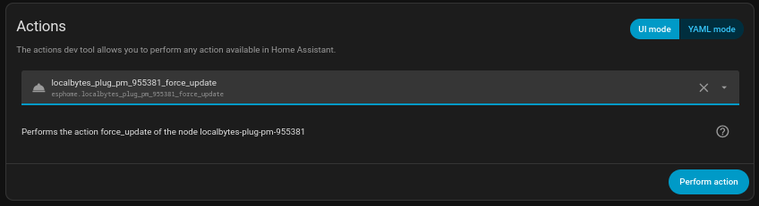

# Whilst mostly complete the contents of this repo are still in testing and should not be used yet.

# ESPHome-Config-for-localbytes-plug-pm
In this repo is an alternative to the [Official Localbytes Config](https://github.com/LocalBytes/esphome-localbytes-plug) for the [LocalBytes Power Monitoring Smart Plug](https://www.mylocalbytes.com/products/smart-plug-pm).

## Disclaimer
I am not an employee of LocalBytes.

By using this you are flashing a firmware onto your device which is not from the manufacturer. You should be careful when doing things like this and check where the firmware comes from and what it does.

## Why do this?
The official firmware has a specific feature set and has not seen much in the way of changes over time as ESPHome has itself become more featureful and optimised.

The official firmware can also be a little slow to update which in some cases has left people unable to install or update their devices.

I am producing this as an alternate option with a slightly different feature set and kept more up to date with the offerings of ESPHome.

This also reduced my device count in the ESPHome builder tool which want to be individually compiled and uploaded to devices witth fixed credentials. Instead I can keep them more as a "Just Works" product.

## The Device
The Smart Plug itself runs a ESP8266 family chip (Specifically a ESP8285) with 1MB of onboard flash to work with.

It comes out the box with either ESPHome or Tasmota Firmware as selected at time of purchase. There is no hardware difference between them and they can be flashed back and forth as needed.

## Features
- Wi-Fi Provisioning.
- IPv6 Support.
- Full compatibility with Home Assistant without any other setup.
- Power on default state can be set as:
    - Always Off
    - Always On
    - Restore Power Off State
- Combined calibration action call that can set any or all calibration multipliers in a single action call.
- Action Call to perform a delayed power cycle of a attached device in specified seconds. This is a great tool if you need to reboot a network device which allows you to connect to the plug so turning it off would result in you unable to turn it back on. This happens entirily on the device so if network is lost it will not interupt it turning back on after the specided time.
- Factory Reset by power cycling 7 times within 10 seconds of each cycle.
- Integrated Update System to stay up to date with the latest releases of the firmware without rebuilding it yourself.

## Wishlist Features that are not implemented
### WebUI for direct control via browser
This is not currently able to be implemented due to limitations of the hardware, The firmware becomes too big. This may in theory be possible if I drop IPv6 Support but on balance I believe that IPv6 is more useful.

### Actions to flash to alternate firmwares directly.
Due to hardware limits this is something that is currently hard to implement.

## Install Instructions
### From a Plug running ESPHome Already
- Connect the plug to your Wi-Fi network if you have not done so already.
- You need to "Take Control" of the device using the ESPHome Builder Tool (explaining setting this up is out of scope for this repo). Which will leave you will a configuration file that looks something like this:
```
substitutions:
  name: localbytes-plug-pm-123456
  friendly_name: Localbytes Plug PM 123456
packages:
  localbytes.plug-pm: github://LocalBytes/esphome-localbytes-plug/localbytes-plug-pm.yaml@main
esphome:
  name: ${name}
  name_add_mac_suffix: false
  friendly_name: ${friendly_name}
api:
  encryption:    
    key: xxxxxxxxxxxxxxxxxxxxxxxxxxxxxxxxxxxxxxxxxxxx

wifi:
  ssid: !secret wifi_ssid
  password: !secret wifi_password
```

You Should replace the package section so it looks like this:

```
substitutions:
  name: localbytes-plug-pm-123456
  friendly_name: Localbytes Plug PM 123456
packages:
  MichaelMKKelly.localbytes-plug-pm: github://MichaelMKKelly/ESPHome-Config-for-localbytes-plug-pm/localbytes-plug-pm.yaml@main
esphome:
  name: ${name}
  name_add_mac_suffix: false
  friendly_name: ${friendly_name}
api:
  encryption:    
    key: xxxxxxxxxxxxxxxxxxxxxxxxxxxxxxxxxxxxxxxxxxxx

wifi:
  ssid: !secret wifi_ssid
  password: !secret wifi_password
```

- OPTIONAL: Once you have flashed the device in this manner if you prefer to not use the ESPHome builder tool any longer then you can delete the device from the tool and then use the force update action call from the Home Assistant action tools page.



Note: You may have to reconnect the device to wifi and/or "Reconfigure" the device in Home Assistant during this process.

### From a Plug running Tasmota
- Connect the plug to your Wi-Fi network if you have not done so already.
- Access the Tasmota WebUI and select "Firmware Upgrade".
- We now want to move to "Tasmota Minimal" to ensure there is room on the bulb to be able to flash our new firmware.
- in the "Upgrade by web server" section you should see the following URL:
  `http://ota.tasmota.com/tasmota/release/tasmota.bin.gz`

  You should change this by adding `-minimal` to the file name so it should now be:

  `http://ota.tasmota.com/tasmota/release/tasmota-minimal.bin.gz`

  Then press "Start Upgrade".
- After a few moments you will be greated by the a notice saying "MINIMAL firmware please upgrade". Again you should select "Firmware Upgrade".
- Now you should upload the latest precomppiled binary of the Firmware from the releases section of this repo. By selecting the file and pressing "Start Upgrade"
- After a moment the Smartplug will restart and you will now neeed to reconnect it to your Wi-Fi network (This time as a ESPHome Device).
- It should now be discovered in Home Assistant (if not then you may need to manully add it by IP Address)

## Credits
- LocalBytes - For making/whitelabeling/selling the [Smartplug](https://www.mylocalbytes.com/products/smart-plug-pm), and publishing the [Official Config](https://github.com/LocalBytes/esphome-localbytes-plug).
- ESPHome Team and the Open Home Foundation - For making [ESPHome](https://esphome.io/).
- JamesSwift - For their work with their [Orginal Repo](https://github.com/JamesSwift/localbytes-plug-pm) which was forked to make the official firmwre.